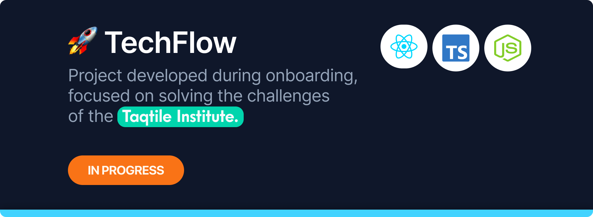

<h1 align="center">TechFlow - TaqTile</h1>

<p align="center">
  
</p>

## 🌐 Project's Description

Project developed during onboarding, focused on solving the challenges of the Taqtile Institute. _(Possible Changes in the Future)_

## 🛠️ Environment and tools

- [React](https://reactjs.org/)
- [Vite](https://vitejs.dev/)
- [TypeScript](https://www.typescriptlang.org/)
- [Node.js](https://nodejs.org/)
- [npm](https://www.npmjs.com/)
- **Additional Tools**:
  - [ESLint](https://eslint.org/) (with [Prettier](https://prettier.io/) integration)
  - [Git](https://git-scm.com/)
  - [VSCode](https://code.visualstudio.com/) (recommended extensions: [Prettier](https://marketplace.visualstudio.com/items?itemName=esbenp.prettier-vscode), [ESLint](https://marketplace.visualstudio.com/items?itemName=dbaeumer.vscode-eslint), [GitLens](https://marketplace.visualstudio.com/items?itemName=eamodio.gitlens))

## ⚙️ Steps to run and debug

1. **Clone the repository**:

   ```bash
   git clone https://github.com/reury-cardoso/desafio-taqtile.git
   ```

2. **Navigate to the project directory**:

   ```bash
   cd desafio-taqtile
   ```

3. **Install dependencies**:

   ```bash
   npm install
   ```

4. **Run the development server**:

   ```bash
   npm run dev
   ```

5. **Access the application**:
   - Open browser in [http://localhost:5173/](http://localhost:5173)

## Optional in Development

- **Lint the code**:

  ```bash
  npm run eslint
  ```

- **Build the project**:
  ```bash
  npm run build
  ```
